# 30DayChartChallenge
 
My contributions to the 30DayChartChallenge. The original page and description can be found [here](https://github.com/Z3tt/30DayChartChallenge_Collection2021).

## Day 1 - Part of whole

## Day 2 - Pictogram

## Day 3 - Historical

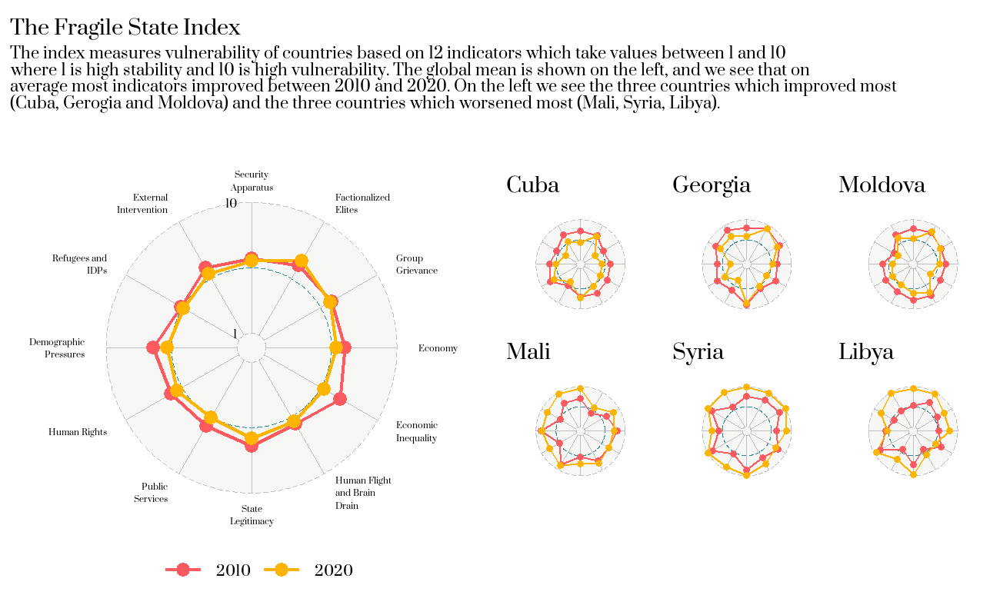

## Day 4 - Magical

## Day 5 - Slope

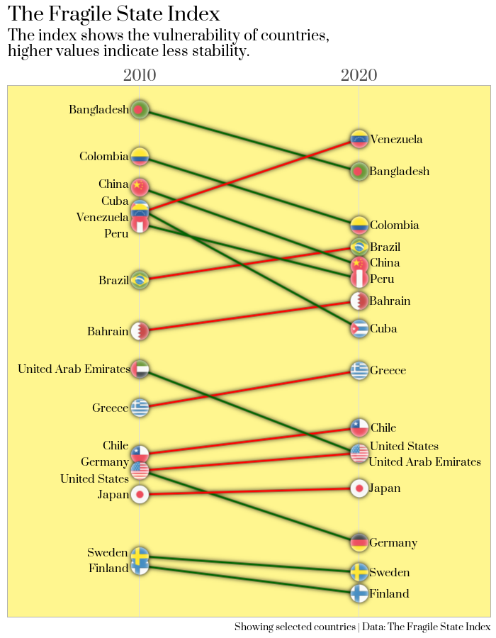

## Day 6 - Experimental

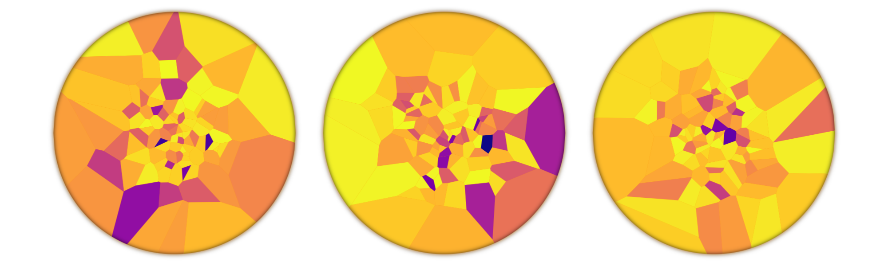

## Day 8 - Animals

## Day 9 - Statistics

## Day 10 - Abstract

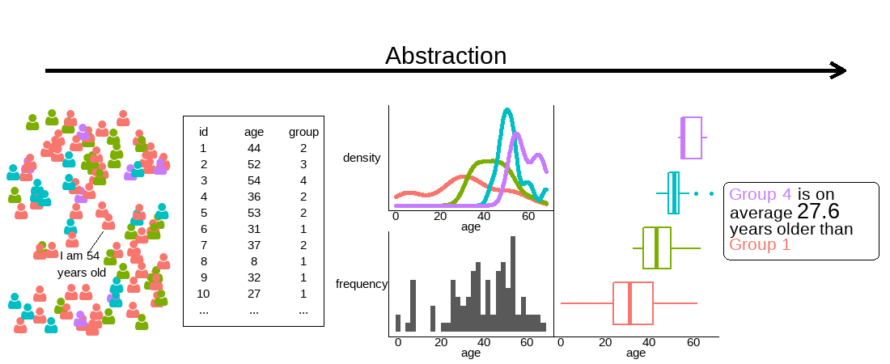

## Day 11 - Circular

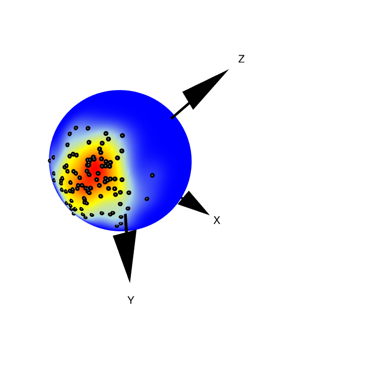

## Day 12 - Strips

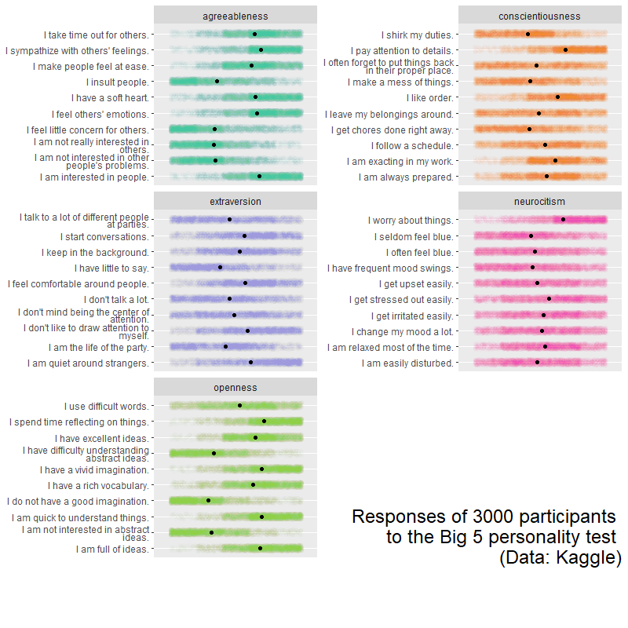

## Day 13 - Correlation

## Day 14 - Space

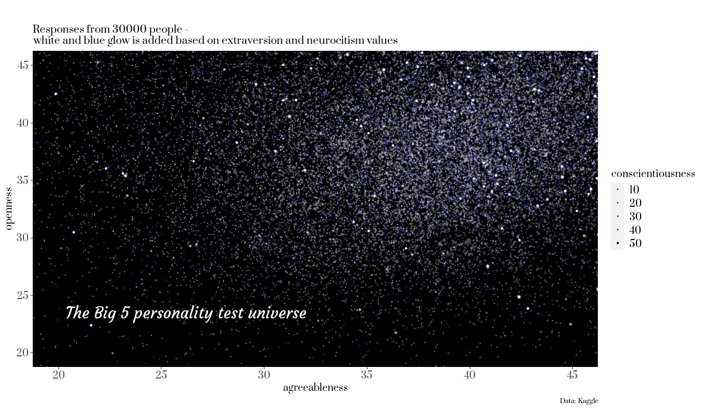

## Day 15 - Multivariate

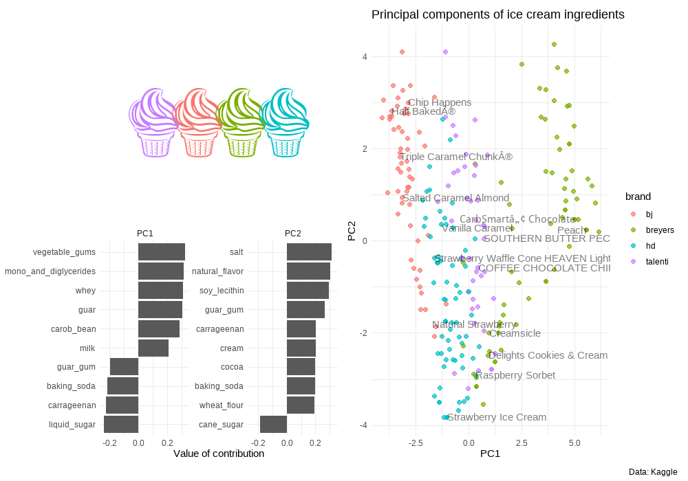

## Day 16 - Trees

## Day 17 - Pop culture

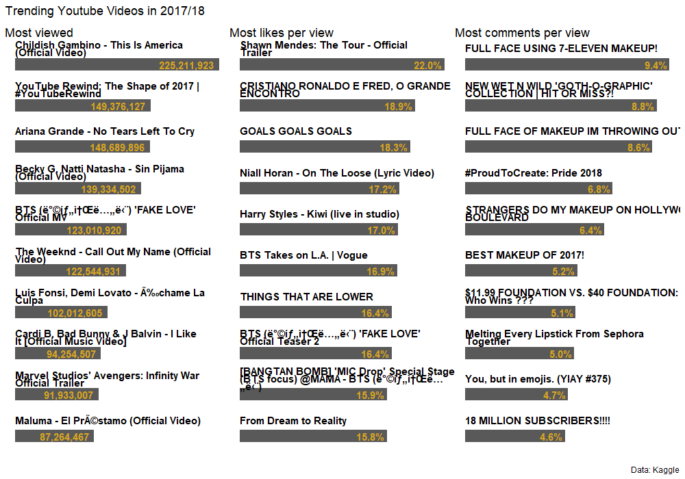

## Day 18 - Connections

## Day 19 - Global change

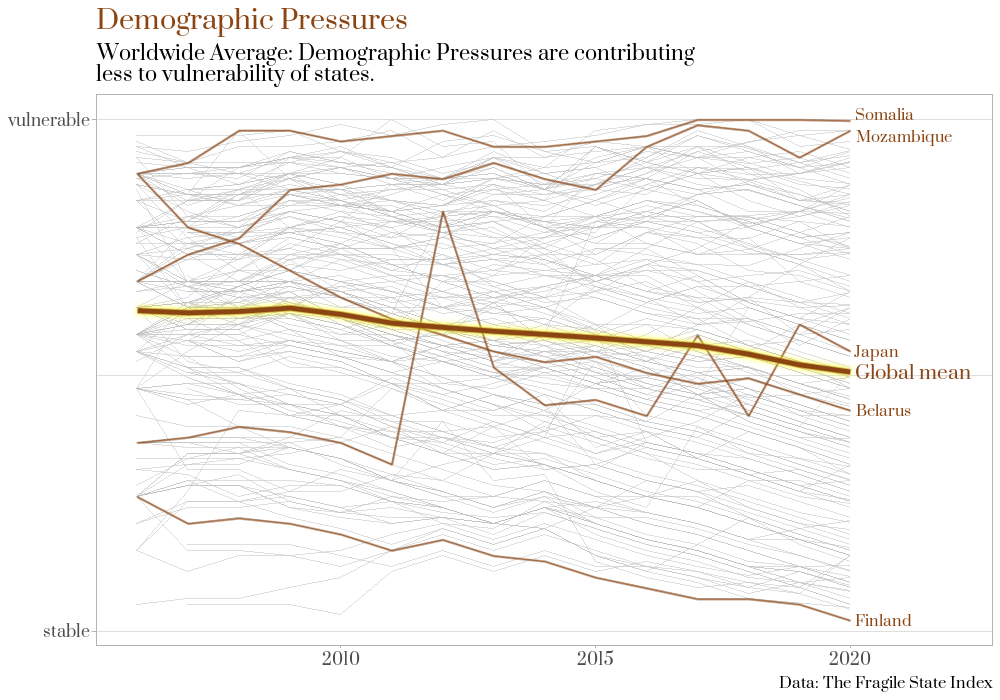

## Day 20 - Upwards

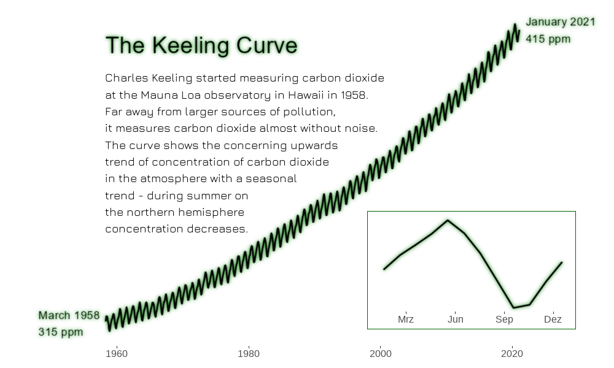
